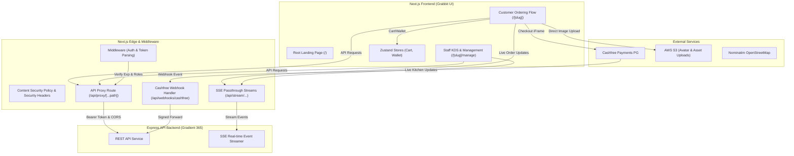

# 📊 Project Analysis Report — Grabbit UI (@gradient365/grabitui)

---

## Executive Summary

**Grabbit** (also branded as **LetsGrabbit**) is a high-performance, mobile-first web application designed for **ordering coffee and food ahead** from local cafes in Delhi NCR. It bridges customers seeking to skip queue wait times with cafe operators looking for streamlined order management, real-time kitchen workflows, and slot-based capacity management.

---

## 1. 🏗️ Tech Stack & Key Dependencies

| Domain | Technology / Library | Description / Purpose |
| :--- | :--- | :--- |
| **Framework** | Next.js 15.5.15 + React 19 | App Router architecture, Server Components, dynamic client routing, dynamic stale time caching (`experimental.staleTimes`). |
| **Language** | TypeScript (v6/v7 alias) | Strict type definitions, shared common types via `@gradient365/gradient-commons`. |
| **Styling & UI** | Tailwind CSS v4 + PostCSS | Custom design token system using CSS variables (`--gb-*`), clean modern design system. |
| **Animations & 3D** | Framer Motion + GSAP + OGL | Smooth micro-interactions, spring transitions, custom WebGL 3D canvas rendering (`circular-gallery-2.tsx`). |
| **State Management** | Zustand (v4.5) | Persistent client state with `persist` middleware (`cart`, `wallet`). |
| **Data Fetching** | TanStack React Query (v5) | Server state caching, background refetching, mutation handling. |
| **Payments** | Cashfree Payments (v3 Drop-in) | Cashfree JS SDK integration, S2S payment flow, HMAC-SHA256 signed webhooks. |
| **Observability** | Sentry (`@sentry/nextjs`) | Client & edge instrumentation for error logging and transaction monitoring. |

---

## 2. 🏛️ System Architecture & Data Flow



---

## 3. 📂 Project Structure & Key Modules

```
grabitui/
├── src/
│   ├── app/                        # Next.js App Router root
│   │   ├── (app)/                  # Tabbed customer view routes
│   │   │   └── (tabs)/             # home, explore, orders, profile
│   │   ├── [slug]/                 # Cafe-specific dynamic routes
│   │   │   ├── (cafe)/manage/      # Staff/Owner KDS, analytics, menu, payouts, slots, onboarding
│   │   │   └── (customer)/         # Menu browsing, cart, checkout, live order tracking, wallet
│   │   ├── api/                    # API endpoints & proxy layer
│   │   │   ├── auth/               # Customer & staff cookie auth handlers
│   │   │   ├── proxy/              # Safe passthrough proxy to Express API
│   │   │   ├── stream/             # Long-lived SSE proxy for order & kitchen updates
│   │   │   └── webhooks/           # Cashfree payment webhook receiver & validator
│   │   ├── globals.css             # Tailwind v4 directives & Grabbit design variables
│   │   ├── layout.tsx              # Root HTML layout with font loading & Sentry
│   │   └── page.tsx                # Marketing SEO Landing page & schema scripts
│   ├── components/                 # React UI components
│   │   ├── gb/                     # Cafe widgets (ReviewSheet, ExploreSearch, CafesNearYou, kit)
│   │   ├── landing/                # Landing page sections (Hero, HowItWorks, FAQSection, PartnerPitch)
│   │   ├── ui/                     # Reusable UI primitives (Circular Gallery WebGL, Testimonials, Chrome)
│   │   └── ReadyToJoinRitual.tsx   # Full-height curtain footer with legal links
│   ├── lib/                        # Core utilities & SEO configuration
│   │   ├── seo.ts                  # Schema.org JSON-LD definitions, keywords, canonical helpers
│   │   └── utils.ts                # Class merge helpers (`clsx`, `tailwind-merge`)
│   ├── store/                      # Zustand state containers (`cart.ts`, `wallet.ts`)
│   ├── types/                      # TypeScript declarations (`grabbit.ts`)
│   └── middleware.ts               # Edge middleware for JWT payload extraction & security gates
├── docs/                           # Architectural plans & specs (`superpowers/`)
├── CLAUDE.md                       # Integration guides & Cashfree skill map
├── next.config.ts                  # Security headers, CSP, Sentry wrapper, route caching settings
└── package.json                    # Dependencies & build scripts
```

---

## 4. 🔑 Core Features & Functional Breakdown

### A. Customer Experience (`/[slug]`)
1. **Interactive Cafe Menu**: Dynamic category filters (Drinks, Food, Specials, Desserts), search, veg/non-veg tags, item customization, and instant cart sync.
2. **Pickup Slot Booking**: Calculates dynamic preparation slot capacity based on preparation times, active workers, and cafe slot parameters.
3. **Flexible Checkout**: Supports online payment via Cashfree SDK (UPI, Cards, Netbanking) or "Pay at Counter".
4. **Real-time Order Tracking**: SSE-based live progress bar (`pending` → `confirmed` → `prepping` → `ready` → `completed`), complete with WhatsApp notification integration.
5. **Customer Wallet & Rewards**: Balance top-up with cash bonuses, slab rewards, streak bonuses, and referral codes.

### B. Cafe Staff & Owner KDS (`/[slug]/manage`)
1. **Kitchen Display System (KDS)**: Real-time SSE order stream notifying kitchen staff of incoming orders with audio/visual alerts.
2. **Eta & Prep Time Calculator**: Calculates prep times dynamically based on active workers and active order queues.
3. **Menu & Availability Control**: Live toggles for item availability, price adjustments, and category sorting.
4. **Capacity & Slot Management**: Custom slot durations, max orders per slot, advance lead time, and cutoff times before closing.
5. **Business Analytics & Payouts**: Daily revenue trends, AOV (Average Order Value), online vs counter breakdown, and Cashfree settlement tracking.
6. **Onboarding & KYC Pipeline**: Multi-step business registration, bank account validation, and regulatory document submissions.

---

## 5. 🛡️ Security, Reliability & Performance

- **Edge Security & Header Hardening**: Strict Content Security Policy (CSP) blocking unauthorized external scripts, framing, and form actions. Explicit `X-Robots-Tag` headers protecting private auth routes from search engine indexing.
- **Constant-Time Webhook Verification**: Cashfree payment webhooks validate `x-webhook-signature` using HMAC-SHA256 with `crypto.timingSafeEqual` to prevent timing attacks, combined with a 300-second timestamp freshness check to reject replay attacks.
- **JWT Edge Parsing**: Next.js Middleware inspects token expiration and injects headers (`x-cafe-id`, `x-staff-id`, `x-staff-role`) at the edge without expensive backend RPCs, leaving signature verification strictly enforced on Express backend API routes.
- **Resilient SSE Streaming**: Streaming routes set `maxDuration = 300` seconds and honor the `Last-Event-ID` header so clients automatically catch up on missed events during network hiccups.
- **Client Cache Optimization**: Configured `experimental.staleTimes` (30s dynamic, 180s static) to ensure instantaneous back/forward navigation without redundant server re-fetches.

---

## 6. 🚀 Operational Commands & Scripts

- `npm run dev`: Starts local Next.js development server on port `3004`.
- `npm run build`: Generates production build bundle.
- `npm run start`: Launches production web server on port `3004`.
- `npm run typecheck`: Runs strict TypeScript type checking (`tsc --noEmit`).
- `npm run lint`: Evaluates Next.js ESLint rules.

---

## 📌 Summary Recommendation

The **Grabbit UI** platform exhibits a highly modular, secure, and modern web architecture tailored for sub-second user responsiveness and real-time operational efficiency. Key areas for ongoing development include extending the wallet backend capabilities and continuously monitoring Sentry telemetry as live cafe traffic expands.
